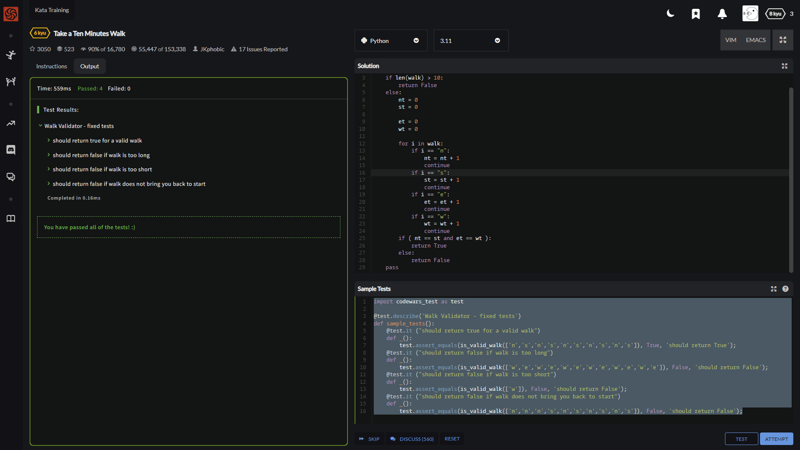
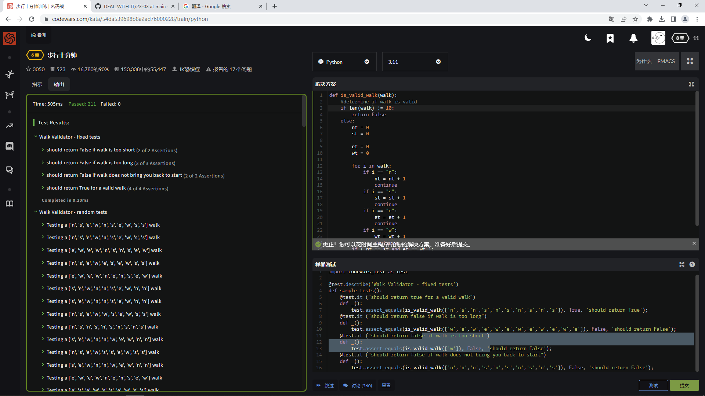

感谢我完美的二手 3060 ti

You live in the city of Cartesia where all roads are laid out in a perfect grid. You arrived ten minutes too early to an appointment, so you decided to take the opportunity to go for a short walk. The city provides its citizens with a Walk Generating App on their phones -- everytime you press the button it sends you an array of one-letter strings representing directions to walk (eg. ['n', 's', 'w', 'e']). You always walk only a single block for each letter (direction) and you know it takes you one minute to traverse one city block, so create a function that will return true if the walk the app gives you will take you exactly ten minutes (you don't want to be early or late!) and will, of course, return you to your starting point. Return false otherwise.

Note: you will always receive a valid array containing a random assortment of direction letters ('n', 's', 'e', or 'w' only). It will never give you an empty array (that's not a walk, that's standing still!).

简单翻译就是

你 现在得到一个由4个元素随机填充的列表 4个元素分别是东南西北

你目前的位置是起点 按照列表的顺序去行走 每个元素代表的方向走1m

如果能走回到原点并且总路程为10m 返回True 否则一律返回False

    呵呵呵 这个题呢 思路还算简单的 互斥方向走的路程只要一样就能回到原点
    说人话就是 (+1) + (-1) = 0 

这算还在爱着初恋吗？ Python用的是and啊

    def is_valid_walk(walk):
        #determine if walk is valid
        if len(walk) > 10: #这里错了啦
            return False
        else:
            nt = 0
            st = 0
            
            et = 0
            wt = 0
            
            for i in walk:
                if i == "n":
                    nt = nt + 1
                    continue
                if i == "s":
                    st = st + 1
                    continue
                if i == "e":
                    et = et + 1
                    continue
                if i == "w":
                    wt = wt + 1
                    continue
            if ( nt == st and et == wt ):
                return True
            else:
                return False
        pass    

呵呵呵 看似正确

呵呵呵 看似正确

---

给的测试数据完美涵盖4个类型

---

    import codewars_test as test

    @test.describe('Walk Validator - fixed tests')
    def sample_tests():
        @test.it ("should return true for a valid walk")
        def _():
            test.assert_equals(is_valid_walk(['n','s','n','s','n','s','n','s','n','s']), True, 'should return True');
        @test.it ("should return false if walk is too long")
        def _():
            test.assert_equals(is_valid_walk(['w','e','w','e','w','e','w','e','w','e','w','e']), False, 'should return False');
        @test.it ("should return false if walk is too short")
        def _():
            test.assert_equals(is_valid_walk(['w']), False, 'should return False');
        @test.it ("should return false if walk does not bring you back to start")
        def _():        
            test.assert_equals(is_valid_walk(['n','n','n','s','n','s','n','s','n','s']), False, 'should return False');

实际测试↓

哦 法克 忘了过短是个啥情况了

修正以下内容

    def is_valid_walk(walk):
        #determine if walk is valid
        if len(walk) != 10: #基本上就是这的问题 之前光顾着算过长 忘了10分钟必须完全满足的需求
            return False
        else:
            nt = 0
            st = 0
            
            et = 0
            wt = 0
            
            for i in walk:
                if i == "n":
                    nt = nt + 1
                    continue
                if i == "s":
                    st = st + 1
                    continue
                if i == "e":
                    et = et + 1
                    continue
                if i == "w":
                    wt = wt + 1
                    continue
            if ( nt == st and et == wt ):
                return True
            else:
                return False
        pass

本以为到这就完事了

直到我看了一眼社区的答案

---

对一个变量进行操作 变量由原来的4个变为2个

    def isValidWalk(walk):
        if len(walk) != 10:
            return False
        x, y = 0, 0
        for direction in walk:
            if direction == 'n':
                y += 1
            elif direction == 's':
                y -= 1
            elif direction == 'e':
                x += 1
            elif direction == 'w':
                x -= 1
            else:
                return False

        return x == 0 and y == 0

---

collections得去了解一下了

    from collections import Counter

    def isValidWalk(walk):
        if len(walk) == 10:
            walkmap = Counter(walk)
            return walkmap['n'] == walkmap['s'] and walkmap['e'] == walkmap['w']
        return False

---

.count EMMMM

很熟悉 我************

    def isValidWalk(walk):
        return len(walk) == 10 and walk.count('n') == walk.count('s') and walk.count('e') == walk.count('w')

---

相似的方法 但应该没用到这个itertools吧 正好也能了解一下这个库

    from itertools import groupby

    def isValidWalk(walk):
        return len(walk) == 10 and walk.count('n') == walk.count('s') and walk.count('e') == walk.count('w')
